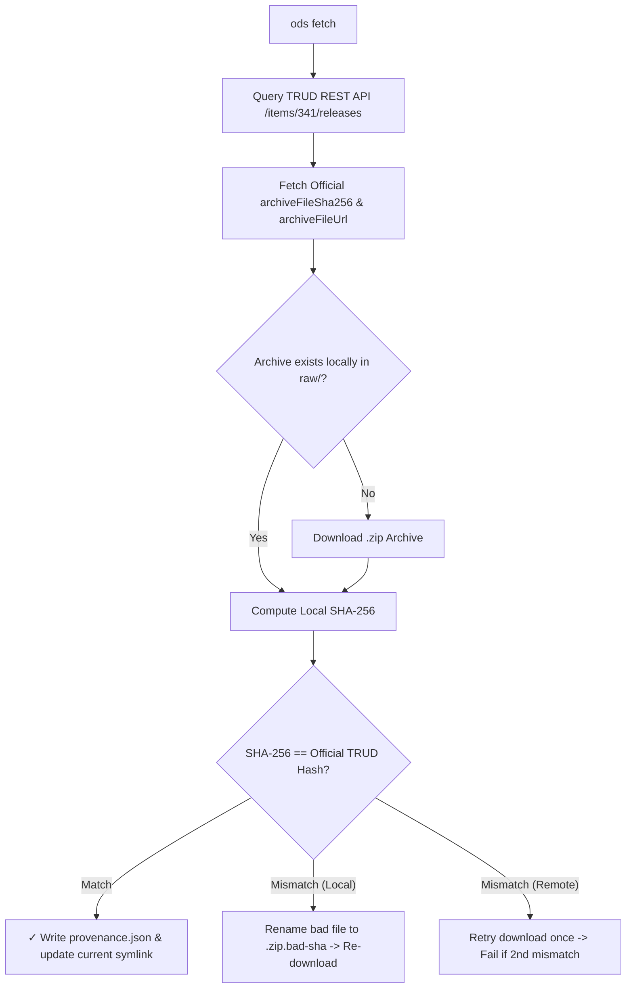

# `ods fetch`

Query, download, and verify official NHS England TRUD ODS XML release archives, generate cryptographic provenance metadata, and manage workspace active release symlinks.

## Usage

```bash
ods fetch [OPTIONS]
```

### Options

| Option | Short | Environment Variable | Default | Description |
| :--- | :--- | :--- | :--- | :--- |
| `--api-key <KEY>` | | `NHS_TRUD_API_KEY` | | Your TRUD API key. Required unless set in environment or passed via 1Password (`op run`). |
| `--release <DATE>` | | | Latest available | Target release date in `YYYY-MM-DD` format (e.g. `2026-07-31`). |
| `--output <DIR>` | `-o` | | `./ods_data/releases/<date>/` | Custom destination directory for archive and provenance files. |
| `--verify-only <FILE>` | | | | Compute local SHA-256 for `<FILE>` and verify against TRUD API without downloading. |
| `--verbose` | `-v` | | `false` | Print API request URL and raw HTTP response payload before deserialization. |

## Examples

### Fetch Latest Release (via 1Password)
```bash
op run --env-file=.env -- ods fetch
```

### Target Specific Release Date with Verbose Logging
```bash
ods fetch --api-key $NHS_TRUD_API_KEY --release 2026-07-31 --verbose
```

### Save to Custom Directory
```bash
ods fetch --api-key $NHS_TRUD_API_KEY -o ./custom_downloads/
```

### Verify Local Archive Checksum
```bash
ods fetch --api-key $NHS_TRUD_API_KEY --verify-only ./ods_data/releases/2026-07-31/raw/hscorgrefdataxml_data_7.0.0_20260731000001.zip
```

## How It Works

### TRUD REST API Integration
NHS Digital / NHS England publishes monthly Organisation Data Service (ODS) updates on TRUD under Item Pack ID `341` (*NHS Organisation Data Service XML Data*).

`ods fetch` executes the following sequence:
1. Queries TRUD REST API (`GET /trud/api/v1/keys/{api_key}/items/341/releases`).
2. Identifies the target release (defaults to the latest available release date).
3. Checks for cached local archives in `./ods_data/releases/<date>/raw/`.
4. Downloads the archive ZIP if not cached.
5. Computes local SHA-256 hash and verifies cryptographic match against TRUD's published `archiveFileSha256`.
6. Generates or updates `provenance.json`.
7. Updates the workspace active release symlink (`./ods_data/current -> releases/<date>`).



### Directory Structure & Workspace Integration
When executed inside an `ods` workspace directory (or default `./ods_data`), `ods fetch` automatically structures the output directory tree. See [docs/ods_data.md](file:///Users/oli/Code/olizilla/ods/docs/ods_data.md) for complete details on directory layout, `.gitignore` rules, and workspace lifecycle commands.

### API Key Security & Redaction
TRUD download URLs embed user API keys directly in their path parameters (`/keys/{api_key}/...`). `ods fetch` automatically redacts secret API keys from:
- `provenance.json` outputs (`trud_release_url`)
- `--verbose` CLI log messages
- Error tracebacks and log files

The key is replaced with `<REDACTED_API_KEY>` before writing or printing.

### Fault Recovery & Idempotency
- **Cache Hit**: Skips downloading if archive already exists and SHA-256 matches. Status lines for `provenance.json` writing and `current` symlink updating are omitted if already up to date.
- **Corrupted Archive Isolation (`.zip.bad-sha`)**: If an existing local file fails SHA-256 verification, it is immediately renamed on disk to `<filename>.zip.bad-sha` and a fresh copy is downloaded.
- **Automated Remote Retry**: If a remote HTTP download fails SHA-256 verification on the first attempt, `ods fetch` deletes the partial download and retries once before bailing.

### Provenance Metadata (`provenance.json`)
See [docs/ods_data.md](file:///Users/oli/Code/olizilla/ods/docs/ods_data.md) for full field definitions and provenance namespace rules.


