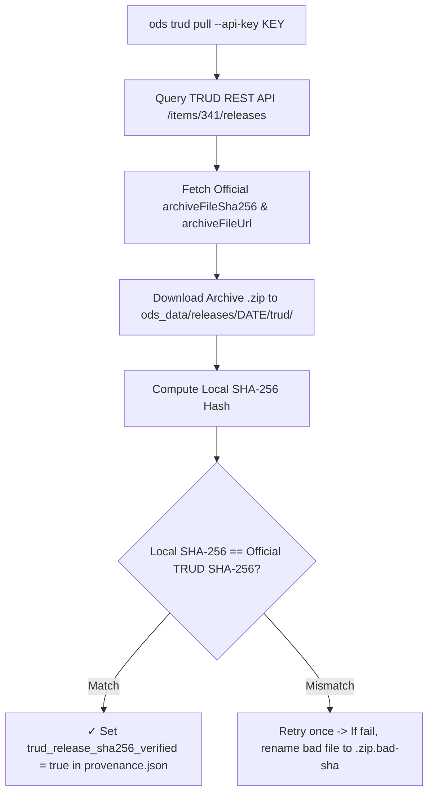

# `ods_data` Workspace Directory

The `ods_data` directory is the local workspace data root managed by the `ods` CLI. It organizes raw TRUD ODS releases, cryptographic provenance metadata, and derived projection artifacts (Parquet tables, NDJSON streams, and OKF Markdown wikis).

## Workspace Directory Tree

When initialized by `ods trud pull` or workspace-aware subcommands, `ods_data` maintains an immutable release archive with an active release pin symlink:

```text
ods_data/
├── README.md                           # Auto-generated workspace query guide & schema documentation
├── .gitignore                           # Ignores raw downloads (releases/*/trud/, *.zip, *.xml)
├── current -> releases/2026-07-31/      # Active workspace release pin (symlink)
└── releases/
    └── 2026-07-31/                     # Immutable release directory (named by release date)
        ├── _provenance.json            # Source TRUD metadata & SHA-256 derived hashes
        ├── orgs.parquet                # Active organisations & sites table (Primary surface)
        ├── orgs_all.parquet            # Complete historical orgs table (active + inactive)
        ├── rels.parquet                # Target relationship links (ICB, Trust, Region, PCN)
        ├── roles.parquet               # Primary & secondary role mappings
        ├── SHA256SUMS                 # Flat verification manifest for _provenance.json and *.parquet
        ├── successors.parquet          # Entity successor chains & reorganisations
        ├── markdown/                   # Open Knowledge Format (OKF) wiki archive
        │   └── wiki.zip
        └── trud/                       # Official TRUD zip archives (gitignored)
            └── hscorgrefdataxml_data_7.0.0_20260731000001.zip
```

## `_provenance.json` Specification & Schema

Every release folder contains a `_provenance.json` file recording the integrity, distribution parameters, inner XML payload attributes, and derived artifact hashes of the dataset.

### Provenance Key Namespaces

`provenance.json` records metadata across three distinct namespaces:

#### Distribution System Metadata (`trud_release_*`)
- **Origin**: Fetched directly from the **NHS TRUD REST API** (`/items/341/releases`).
- **Scope**: Represents the **distribution container / envelope** published on TRUD.
- **Fields**:
  - `trud_release_name`: Human-readable version string (e.g. `"Release 7.0.0"`).
  - `trud_release_date`: Official release date in `YYYY-MM-DD` format (e.g. `"2026-07-31"`).
  - `trud_release_file`: TRUD archive ZIP filename (e.g. `"hscorgrefdataxml_data_7.0.0_20260731000001.zip"`).
  - `trud_release_filesize_bytes`: Archive file size in bytes (`37983173`).
  - `trud_release_sha256`: Published SHA-256 checksum from NHS TRUD.
  - `trud_release_sha256_verified`: Set to `true` when local archive SHA-256 matches TRUD release hash.
  - `trud_release_url`: Download URL with API key sanitized (`https://isd.digital.nhs.uk/download/api/v1/keys/<REDACTED_API_KEY>/...`).

#### Inner Data Content Metadata (`publication_*`)
- **Origin**: Extracted from the `<un:ManifestHeader>` tag inside the inner XML file (`HSCOrgRefData.xml`).
- **Scope**: Represents the **domain data publication attributes** embedded within the XML payload.
- **Fields**:
  - `publication_type`: Release type (`"Full"` or `"Incremental"`).
  - `publication_source`: Issuing authority (`"HSCIC"` / `"NHS England"`).
  - `publication_seq_num`: Sequential publication run sequence number (e.g. `"4574"`).

#### Tool Execution Metadata (`output_path`, `ods_cmd_version`, `fetched_at`, `compiled_at`)
- `output_path`: Relative disk path where the archive was saved (`"./raw/hscorgrefdataxml_data_7.0.0_20260731000001.zip"`).
- `ods_cmd_version`: Version of the `ods` CLI tool that executed the operation (`"0.1.0"`).
- `fetched_at`: Timestamp when the archive was downloaded/verified from TRUD.
- `compiled_at`: Timestamp when the dataset was compiled into Parquet / NDJSON.

### Example `provenance.json`

```json
{
  "_type": "ods_provenance",
  "trud_release_name": "Release 7.0.0",
  "trud_release_date": "2026-07-31",
  "trud_release_file": "hscorgrefdataxml_data_7.0.0_20260731000001.zip",
  "trud_release_filesize_bytes": 37983173,
  "trud_release_sha256": "8151248DDC290F3AFFDABAE22D88E0BBD118947D948AB7BDD37E74088CFBA933",
  "trud_release_sha256_verified": true,
  "trud_release_url": "https://isd.digital.nhs.uk/download/api/v1/keys/<REDACTED_API_KEY>/content/items/341/hscorgrefdataxml_data_7.0.0_20260731000001.zip",
  "publication_seq_num": "4574",
  "publication_type": "Full",
  "publication_source": "HSCIC",
  "ods_cmd_version": "0.1.0"
}
```

## Cryptographic SHA-256 Verification Flow



## Command Integration & Workspace Lifecycle

| Subcommand | Interaction with `ods_data` |
| :--- | :--- |
| **`ods trud pull`** | Queries TRUD API, downloads ZIP into `releases/<date>/trud/`, verifies SHA-256, writes `provenance.json`, and updates `current` symlink. |
| **`ods cite`** | Displays active release pin, provenance metadata, local release versions, disk space, and SHA-256 verification status. |
| **`ods pull`** | Pulls pre-built dataset release or switches active release pin to target release date. |
| **`ods trud audit`** | Validates workspace Parquet tables against ground-truth TRUD XML/ZIP archives and verifies release provenance alignment. |
| **`ods find`** | Queries active workspace Parquet tables in `ods_data/current/parquet/` automatically. |
