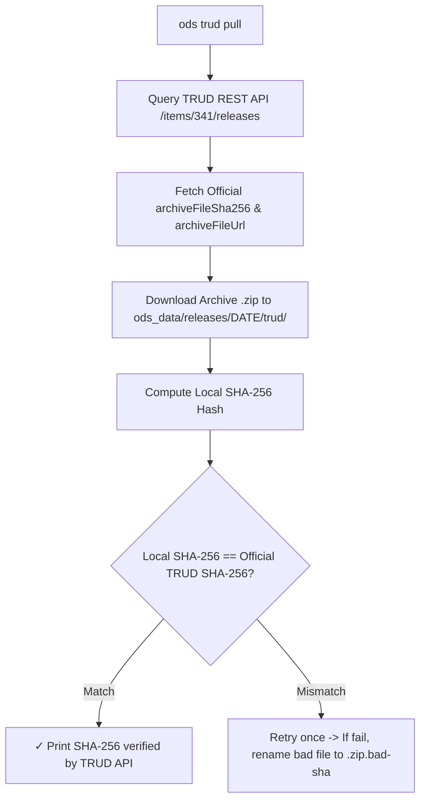

# `ods_data` Workspace Directory

The `ods_data` directory is the local workspace data root managed by the `ods` CLI. It organizes raw TRUD ODS releases, cryptographic provenance metadata, and derived projection artifacts (Parquet tables).

## Workspace Directory Tree

When initialized by `ods trud pull` or workspace-aware subcommands, `ods_data` maintains an immutable release archive with an active release pin symlink:

```text
ods_data/
├── README.md                           # Auto-generated workspace query guide & schema documentation
├── .gitignore                           # Ignores raw downloads (releases/*/trud/, *.zip, *.xml)
├── current -> releases/2026-07-31/      # Active workspace release pin (symlink)
└── releases/
    └── 2026-07-31/                     # Immutable release directory (named by release date)
        ├── _provenance.json            # Source TRUD metadata & build provenance
        ├── orgs.parquet                # Every organisation & site, active and inactive: filter on status (Primary surface)
        ├── relationships.parquet       # Target relationship links (ICB, Trust, Region, PCN)
        ├── roles.parquet              # Primary & secondary role mappings
        ├── successions.parquet        # Entity successor chains & reorganisations
        ├── datapackage.json           # Frictionless Data Package descriptor
        └── trud/                      # Official TRUD zip archives (gitignored)
            └── hscorgrefdataxml_data_7.0.0_20260731000001.zip
```

## `_provenance.json` Specification & Schema

Every release folder contains a `_provenance.json` file recording the integrity, source parameters, and build tool environment of the dataset.

### Provenance keys

`_provenance.json` holds five keys, all describing NHS's archive: `$schema` and the four `trud_*` facts.

- **Origin**: Fetched directly from the **NHS TRUD REST API** (`/items/341/releases`) and extracted from the XML root manifest.
- **Scope**: Represents the **source archive** published on TRUD.
- **Fields**:
  - `trud_release_date`: Official release date in `YYYY-MM-DD` format (e.g. `"2026-07-31"`).
  - `trud_release_filesize_bytes`: Archive file size in bytes (`37983173`).
  - `trud_release_sha256`: Published SHA-256 checksum from NHS TRUD.
  - `trud_schema_version`: ODS XML schema version extracted from the manifest namespace (e.g. `"2-0-0"`).

Which `ods` built a published dataset is recorded in its release index row (`tool_version`, `tool_git_sha`, see [release-index.md](./release-index.md)) and in the CI attestation, not here. How the archive was checked is printed when the check runs and not stored. See [provenance.md](./provenance.md) for why.

### Example `_provenance.json`

```json
{
  "$schema": "https://ods.fyi/schema/provenance.v1.json",
  "trud_release_date": "2026-07-31",
  "trud_release_filesize_bytes": 37983173,
  "trud_release_sha256": "8151248DDC290F3AFFDABAE22D88E0BBD118947D948AB7BDD37E74088CFBA933",
  "trud_schema_version": "2-0-0"
}
```

## Cryptographic SHA-256 Verification Flow



## Command Integration & Workspace Lifecycle

| Subcommand | Interaction with `ods_data` |
| :--- | :--- |
| **`ods trud list`** | Queries TRUD API and lists available release archives, indicating which are held in the workspace. |
| **`ods trud pull`** | Queries TRUD API, downloads ZIP into `releases/<date>/trud/`, verifies SHA-256, writes `_provenance.json`, and updates `current` symlink. |
| **`ods cite`** | Displays active release pin, provenance metadata, local release versions, disk space, and SHA-256 verification status. |
| **`ods pull`** | Pulls pre-built dataset release or switches active release pin to target release date. |
| **`ods trud audit`** | Validates workspace Parquet tables against ground-truth TRUD XML/ZIP archives and verifies release provenance alignment. |
| **`ods find`** | Queries active workspace Parquet tables in `ods_data/current/orgs.parquet` automatically. |
