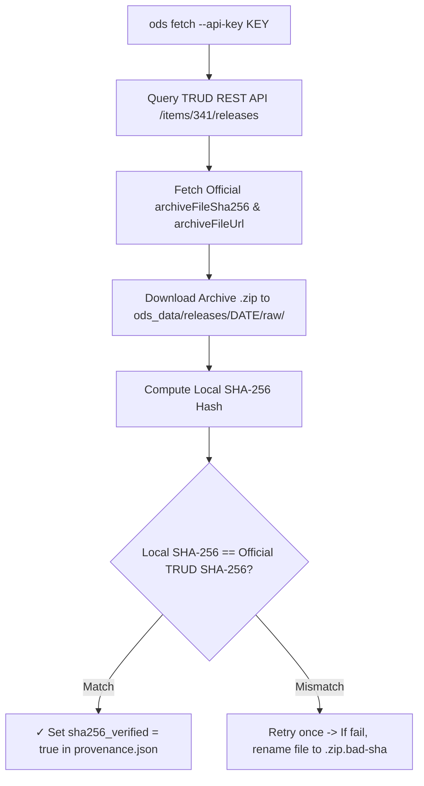

# ODS Data Provenance & Cryptographic SHA-256 Verification

This document details dataset provenance tracking, cryptographic SHA-256 checksum verification against official NHS TRUD API releases, and field definitions in `OdsProvenance`.

---

## 1. Provenance Key Namespaces

`OdsProvenance` records metadata across four distinct namespaces:

### A. `trud_release_*` (Distribution System Metadata)
- **Origin**: Fetched directly from the **NHS TRUD REST API** (`/items/341/releases`).
- **Scope**: Represents the **distribution container / envelope** published on TRUD.
- **Fields**:
  - `trud_release_name`: TRUD's release labelNot unique. Not semver. (e.g. `"Release 7.0.0"`).
  - `trud_release_date`: Official publication date (e.g. `"2026-07-31"`).
  - `trud_release_file`: Archive filename (e.g. `"hscorgrefdataxml_data_7.0.0_20260731000001.zip"`).
  - `trud_release_filesize_bytes`: Archive file size in bytes (`37983173`).
  - `trud_release_sha256`: Published SHA-256 checksum from NHS TRUD.
  - `trud_release_sha256_verified`: Verification status (`"trud_api"`, `"published_release"`, or `"unverified"`).

> [!NOTE]
> The source TRUD download URL is derivable from `trud_release_file` and the TRUD item ID (`341`), so it is not stored in provenance (avoiding environment-dependent strings in hashed artifacts).

### B. `publication_*` (Inner Data Content Metadata)
- **Origin**: Extracted from the `<un:ManifestHeader>` tag inside the inner XML file (`HSCOrgRefData.xml`).
- **Scope**: Represents the **domain data publication attributes** embedded within the XML payload.
- **Fields**:
  - `publication_date`: Date the XML snapshot was generated (e.g. `"2026-07-28"`).
  - `publication_seq_num`: Sequential publication run sequence number (e.g. `"4700"`).
  - `publication_type`: Release type (`"Full"` or `"Incremental"`).
  - `publication_source`: Issuing authority (`"HSCIC"` / `"NHS England"`).
  - `publication_record_count`: Number of organisation records declared in XML manifest.

### C. Tool and Dataset Metadata (`tool_*`, `dataset_*`)
- `tool_git_sha`: Git commit SHA of the `ods` binary that generated the projections.
- `tool_git_dirty`: Optional boolean present when built from an uncommitted working tree.
- `tool_version`: Cargo package version of `ods` (`"0.1.0"`).
- `dataset_revision`: Project publication revision number for this release (defaults to `1`).
- `dataset_parquet_schema_version`: SemVer of the Frictionless Table Schema contract (`"0.1.0"`).
- `dataset_file_sha256`: Map of filenames to uppercase SHA-256 hashes for all derived artifacts in the release directory (`orgs.parquet`, `datapackage.json`, etc.).

---

## 2. Complete `_provenance.json` Schema Example

```json
{
  "_type": "ods_provenance",
  "trud_release_name": "Release 7.0.0",
  "trud_release_date": "2026-07-31",
  "trud_release_file": "hscorgrefdataxml_data_7.0.0_20260731000001.zip",
  "trud_release_filesize_bytes": 37983173,
  "trud_release_sha256": "8151248DDC290F3AFFDABAE22D88E0BBD118947D948AB7BDD37E74088CFBA933",
  "trud_release_sha256_verified": "trud_api",
  "publication_date": "2026-07-28",
  "publication_seq_num": "4700",
  "publication_type": "Full",
  "publication_source": "HSCIC",
  "publication_record_count": 305541,
  "tool_git_sha": "f0630a986ca87489933bfb528214434329e2c02f",
  "tool_version": "0.1.0",
  "dataset_revision": 1,
  "dataset_parquet_schema_version": "0.1.0",
  "dataset_file_sha256": {
    "datapackage.json": "A97DF19890FA3E8D0911739D1C78D24E6FDF4C767D6F18DB6A7DA9FEF53702BC",
    "org_roles.parquet": "748888DDC8B943A5D4468EAF28DC86E5CA4BC0E6B65D4EE0612086AF764BBF16",
    "orgs.parquet": "BCB99933EF266184C428EA85B17DFE034177FBC80BAEC5CA78EAA088CD6DF328",
    "orgs_all.parquet": "AAB81239EF266184C428EA85B17DFE034177FBC80BAEC5CA78EAA088CD6DF328",
    "relationships.parquet": "D3904E0BD22F226D14264627DF2345BD827A13B44B36CDE231737F9941C54C91",
    "roles.parquet": "0E05537F55BE7B06692994644BA8D1429B5FA08BFE2FE7BE51B404DF21E19C5B",
    "successions.parquet": "FF98239EF266184C428EA85B17DFE034177FBC80BAEC5CA78EAA088CD6DF328"
  }
}
```

---

## 3. Automated Release Download & Verification Flow




