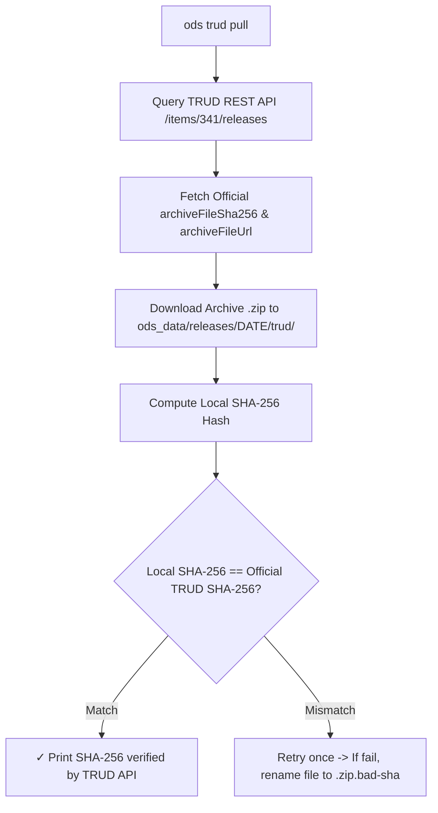

# ODS Data Provenance & Cryptographic SHA-256 Verification

This document details dataset provenance tracking, cryptographic SHA-256 checksum verification against official NHS TRUD API releases, and field definitions in `OdsProvenance`.

---

## What provenance holds

`_provenance.json` describes NHS's archive and nothing else. It holds five keys:

- `$schema`: names the format and links to its schema.
- `trud_release_date`: official publication date from TRUD (e.g. `"2026-07-31"`).
- `trud_release_sha256`: published SHA-256 checksum from NHS TRUD.
- `trud_release_filesize_bytes`: archive file size in bytes (`37983173`).
- `trud_schema_version`: ODS XML schema version extracted from the manifest namespace (e.g. `"2-0-0"`).

The `trud_*` keys come from the **NHS TRUD REST API** (`/items/341/releases`) and the source XML root `<un:OrganisationManifest>`.

Two things are deliberately not here, because either would put the builder's circumstances into the manifest digest:

- **Which `ods` built a published dataset.** Its row in the release index records `tool_version` and `tool_git_sha` (see [release-index.md](./release-index.md)), and the CI attestation for the same manifest digest is the signed proof.
- **How the archive was checked.** `ods trud pull` and `ods make` print what they found, including a `!` line when nothing could vouch for the archive, and store nothing. What vouches for a published release is its row in the release index, which records TRUD's hash, date and size.

So the manifest digest is a function of the archive and the dataset version. Any `ods` whose `DATASET_VERSION` is that version rebuilds a published dataset byte for byte, however the archive was checked.

## Complete `_provenance.json` example

```json
{
  "$schema": "https://ods.fyi/schema/provenance.v1.json",
  "trud_release_date": "2026-07-31",
  "trud_release_sha256": "8151248DDC290F3AFFDABAE22D88E0BBD118947D948AB7BDD37E74088CFBA933",
  "trud_release_filesize_bytes": 37983173,
  "trud_schema_version": "2-0-0"
}
```

## The rules

- **Provenance is where the data came from.** Source facts (`trud_*`), and nothing else. Who built the dataset lives in the release index row and the CI attestation, and how the archive was checked is shown when it runs.
- **The descriptor is what the data is.** `datapackage.json` holds the schema contract, table descriptions, field types, and dataset `version`. If it describes the data rather than its origins, it belongs in the descriptor.
- **Parquet metadata is what survives a relabel.** Key-value metadata on the parquet files holds only facts that cannot change without rebuilding the parquet bytes. `ods.trud_release_date` and `ods.trud_release_sha256` only.
- **`$schema` names the format and links to the schema.** The schema at [provenance.v1.json](https://ods.fyi/schema/provenance.v1.json) (or `worker/schema/provenance.v1.json`) is the reference for every field.
- **The schema version moves with the media type.** The manifest types this blob `application/vnd.fyi.ods.provenance.v1+json`. Any change to provenance's fields means a new schema file and a new media type version together. A published schema file never changes.
- **Build-run facts live in the attestation, never in the file.** Machine names, runner IDs, and timestamps belong in the signed SLSA attestation outside the dataset. Inside provenance, they would prevent rebuilds reproducing identical layer digests.

---

## Automated Release Download & Verification Flow


