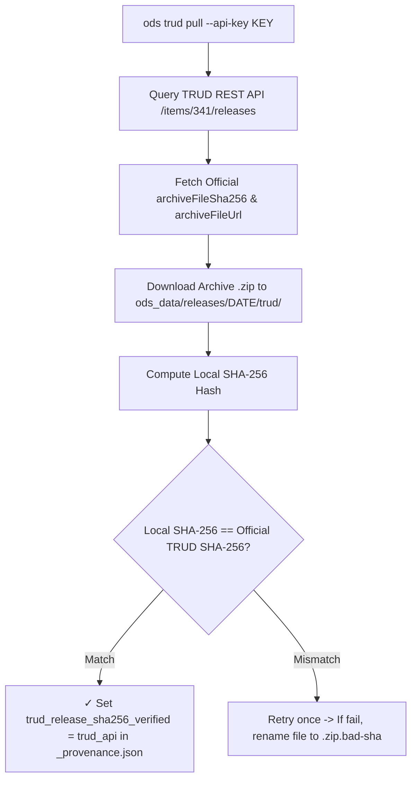

# ODS Data Provenance & Cryptographic SHA-256 Verification

This document details dataset provenance tracking, cryptographic SHA-256 checksum verification against official NHS TRUD API releases, and field definitions in `OdsProvenance`.

---

## Provenance Key Namespaces

`OdsProvenance` records metadata across four distinct namespaces:

### A. `trud_release_*` (Distribution System Metadata)
- **Origin**: Fetched directly from the **NHS TRUD REST API** (`/items/341/releases`).
- **Scope**: Represents the **distribution container / envelope** published on TRUD.
- **Fields**:
  - `trud_release_name`: TRUD's release labelNot unique. Not semver. (e.g. `"Release 7.0.0"`).
  - `trud_release_date`: Official publication date (e.g. `"2026-07-31"`).
  - `trud_release_file`: Archive filename (e.g. `"hscorgrefdataxml_data_7.0.0_20260731000001.zip"`).
  - `trud_release_filesize_bytes`: Archive file size in bytes (`37983173`).
  - `trud_release_sha256`: Published SHA-256 checksum from NHS TRUD.
  - `trud_release_sha256_verified`: Verification status (`"trud_api"`, `"published_release"`, or `"unverified"`).

> [!NOTE]
> The source TRUD download URL is derivable from `trud_release_file` and the TRUD item ID (`341`), so it is not stored in provenance (avoiding environment-dependent strings in hashed artifacts).

### B. `publication_*` (Inner Data Content Metadata)
- **Origin**: Extracted from the `<un:ManifestHeader>` tag inside the inner XML file (`HSCOrgRefData.xml`).
- **Scope**: Represents the **domain data publication attributes** embedded within the XML payload.
- **Fields**:
  - `publication_date`: Date the XML snapshot was generated (e.g. `"2026-07-28"`).
  - `publication_seq_num`: Sequential publication run sequence number (e.g. `"4700"`).
  - `publication_type`: Release type (`"Full"` or `"Incremental"`).
  - `publication_source`: Issuing authority (`"HSCIC"` / `"NHS England"`).
  - `publication_record_count`: Number of organisation records declared in XML manifest.

### C. Tool and Dataset Metadata (`tool_*`, `dataset_*`)
- `tool_git_sha`: Git commit SHA of the `ods` binary that generated the projections.
- `tool_git_dirty`: Optional boolean present when built from an uncommitted working tree.
- `tool_version`: Cargo package version of `ods` (`"0.1.0"`).
- `dataset_version`: SemVer identifying the dataset schema cut and release attempt (`"0.1.0"`).

---

## Complete `_provenance.json` example

```json
{
  "$schema": "https://ods.fyi/schema/provenance.v1.json",
  "trud_release_name": "Release 7.0.0",
  "trud_release_date": "2026-07-31",
  "trud_release_file": "hscorgrefdataxml_data_7.0.0_20260731000001.zip",
  "trud_release_filesize_bytes": 37983173,
  "trud_release_sha256": "8151248DDC290F3AFFDABAE22D88E0BBD118947D948AB7BDD37E74088CFBA933",
  "trud_release_sha256_verified": "trud_api",
  "publication_date": "2026-07-28",
  "publication_seq_num": "4700",
  "publication_type": "Full",
  "publication_source": "HSCIC",
  "publication_schema_version": "2-0-0",
  "publication_record_count": 305541,
  "tool_git_sha": "f0630a986ca87489933bfb528214434329e2c02f",
  "tool_version": "0.1.0",
  "dataset_version": "0.1.0"
}
```

## The rules

- **`$schema` names the format and links to the schema.** The schema at [provenance.v1.json](https://ods.fyi/schema/provenance.v1.json) (or `worker/schema/provenance.v1.json`) is the reference for every field.
- **The schema version moves with the media type.** The manifest types this blob `application/vnd.fyi.ods.provenance.v1+json`. Any change to provenance's fields means a new schema file and a new media type version together. A published schema file never changes.
- **Build-run facts live in the attestation, never in the file.** Machine names, runner IDs, and timestamps belong in the signed SLSA attestation outside the dataset. Inside provenance, they would prevent rebuilds reproducing identical layer digests.

---

## Automated Release Download & Verification Flow




