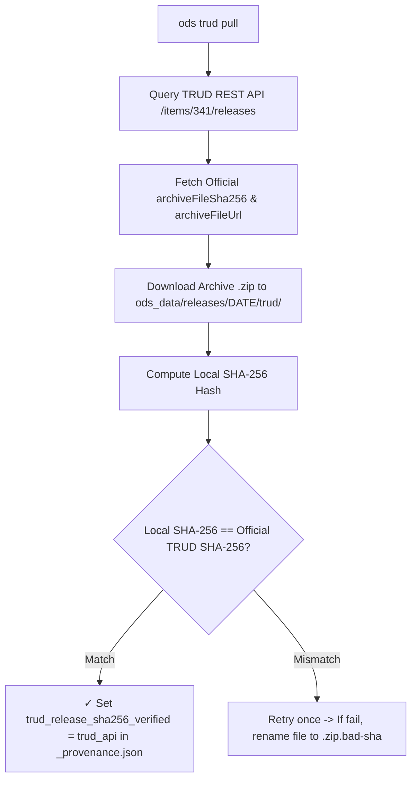

# ODS Data Provenance & Cryptographic SHA-256 Verification

This document details dataset provenance tracking, cryptographic SHA-256 checksum verification against official NHS TRUD API releases, and field definitions in `OdsProvenance`.

---

## Provenance Key Namespaces

`OdsProvenance` records metadata across two distinct namespaces:

### A. `trud_*` (Source Archive Metadata)
- **Origin**: Fetched from the **NHS TRUD REST API** (`/items/341/releases`) and the source XML root `<un:OrganisationManifest>` namespace.
- **Scope**: Represents the **source archive** published on TRUD.
- **Fields**:
  - `trud_release_date`: Official publication date from TRUD API (e.g. `"2026-07-31"`).
  - `trud_release_sha256`: Published SHA-256 checksum from NHS TRUD.
  - `trud_release_sha256_verified`: Verification status (`"trud_api"`, `"published_release"`, or `"unverified"`).
  - `trud_release_filesize_bytes`: Archive file size in bytes (`37983173`).
  - `trud_schema_version`: ODS XML schema version extracted from the manifest namespace (e.g. `"2-0-0"`).

### B. `tool_*` (Build Tool Metadata)
- `tool_version`: Cargo package version of `ods` (`"0.1.0"`).
- `tool_git_sha`: Git commit SHA of the `ods` binary that generated the projections.
- `tool_git_dirty`: Boolean flag indicating whether the binary was built from an uncommitted working tree.

---

## Complete `_provenance.json` example

```json
{
  "$schema": "https://ods.fyi/schema/provenance.v1.json",
  "trud_release_date": "2026-07-31",
  "trud_release_sha256": "8151248DDC290F3AFFDABAE22D88E0BBD118947D948AB7BDD37E74088CFBA933",
  "trud_release_sha256_verified": "trud_api",
  "trud_release_filesize_bytes": 37983173,
  "trud_schema_version": "2-0-0",
  "tool_version": "0.1.0",
  "tool_git_sha": "f0630a986ca87489933bfb528214434329e2c02f",
  "tool_git_dirty": false
}
```

## The rules

- **Provenance is where the data came from and how it was built.** Source facts (`trud_*`) and build facts (`tool_*`). Nothing else.
- **The descriptor is what the data is.** `datapackage.json` holds the schema contract, table descriptions, field types, and dataset `version`. If it describes the data rather than its origins, it belongs in the descriptor.
- **Parquet metadata is what survives a relabel.** Key-value metadata on the parquet files holds only facts that cannot change without rebuilding the parquet bytes. `ods.trud_release_date` and `ods.trud_release_sha256` only.
- **`$schema` names the format and links to the schema.** The schema at [provenance.v1.json](https://ods.fyi/schema/provenance.v1.json) (or `worker/schema/provenance.v1.json`) is the reference for every field.
- **The schema version moves with the media type.** The manifest types this blob `application/vnd.fyi.ods.provenance.v1+json`. Any change to provenance's fields means a new schema file and a new media type version together. A published schema file never changes.
- **Build-run facts live in the attestation, never in the file.** Machine names, runner IDs, and timestamps belong in the signed SLSA attestation outside the dataset. Inside provenance, they would prevent rebuilds reproducing identical layer digests.

---

## Automated Release Download & Verification Flow


