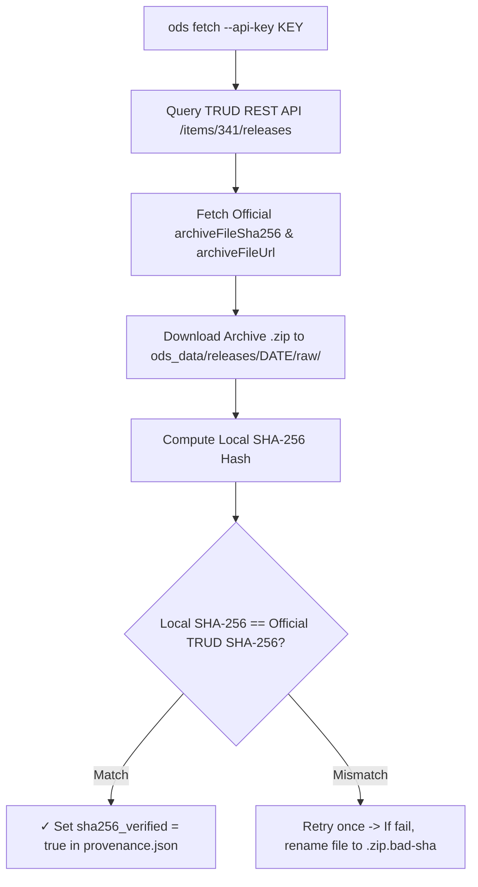

# ODS Data Provenance & Cryptographic SHA-256 Verification

This document details dataset provenance tracking, cryptographic SHA-256 checksum verification against official NHS TRUD API releases, and field definitions in `OdsProvenance`.

---

## 1. Provenance Key Namespaces

`OdsProvenance` records metadata across four distinct namespaces:

### A. `trud_release_*` (Distribution System Metadata)
- **Origin**: Fetched directly from the **NHS TRUD REST API** (`/items/341/releases`).
- **Scope**: Represents the **distribution container / envelope** published on TRUD.
- **Fields**:
  - `trud_release_name`: Human-readable version string (e.g. `"Release 7.0.0"`).
  - `trud_release_date`: Official publication date (e.g. `"2026-07-31"`).
  - `trud_release_file`: Archive filename (e.g. `"hscorgrefdataxml_data_7.0.0_20260731000001.zip"`).
  - `trud_release_filesize_bytes`: Archive file size in bytes (`37983173`).
  - `trud_release_sha256`: Published SHA-256 checksum from NHS TRUD.
  - `trud_release_sha256_verified`: Set to `true` when local archive SHA-256 matches TRUD release hash.
  - `trud_release_url`: Download URL with API key sanitized.

### B. `publication_*` (Inner Data Content Metadata)
- **Origin**: Extracted from the `<un:ManifestHeader>` tag inside the inner XML file (`HSCOrgRefData.xml`).
- **Scope**: Represents the **domain data publication attributes** embedded within the XML payload.
- **Fields**:
  - `publication_type`: Release type (`"Full"` or `"Incremental"`).
  - `publication_source`: Issuing authority (`"HSCIC"` / `"NHS England"`).
  - `publication_seq_num`: Sequential publication run sequence number (e.g. `"4574"`).

### C. Pipeline Tool & Local Path Metadata (`ods_cmd_version`)
raw/hscorgrefdataxml_data_7.0.0_20260731000001.zip"`).
- `ods_cmd_version`: Version of the `ods` CLI tool (`"0.1.0"`).


---

## 2. Complete `provenance.json` Schema Example

```json
{
  "_type": "ods_provenance",
  
  "trud_release_name": "Release 7.0.0",
  "trud_release_date": "2026-07-31",
  "trud_release_file": "hscorgrefdataxml_data_7.0.0_20260731000001.zip",
  "trud_release_filesize_bytes": 37983173,
  "trud_release_sha256": "8151248DDC290F3AFFDABAE22D88E0BBD118947D948AB7BDD37E74088CFBA933",
  "trud_release_sha256_verified": true,
  "trud_release_url": "https://isd.digital.nhs.uk/download/api/v1/keys/<REDACTED_API_KEY>/content/items/341/hscorgrefdataxml_data_7.0.0_20260731000001.zip",
  
  "publication_seq_num": "4574",
  "publication_type": "Full",
  "publication_source": "HSCIC",
  
  "ods_cmd_version": "0.1.0",
}
```

---

## 3. Automated Release Download & Verification Flow




