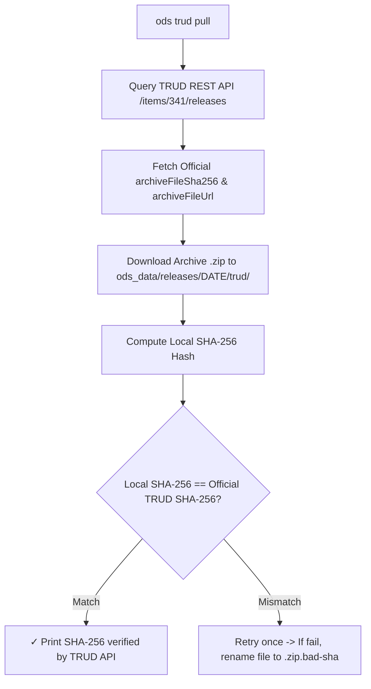

# ODS data provenance and SHA-256 verification

This document details dataset provenance tracking, SHA-256 checksum verification against official NHS TRUD API releases, and field definitions in `OdsProvenance`.

## What provenance holds

`_provenance.json` describes NHS's archive and the terms under which it was published, and nothing else. It holds exactly six keys:

- `$schema`: names the format and links to its schema (`https://ods.fyi/schema/provenance.v1.json`).
- `trud_release_date`: official publication date from TRUD (e.g. `"2026-07-31"`).
- `trud_release_sha256`: published SHA-256 checksum from NHS TRUD.
- `trud_release_filesize_bytes`: archive file size in bytes (`37983173`).
- `license`: the licence terms under which the data was released (`"Open Government Licence v3.0"`).
- `attribution`: the required attribution statement (`"Contains public sector information licensed under the Open Government Licence v3.0."`).

A dataset's `_provenance.json` is a copy of what TRUD said about its archive, taken from TRUD's API or from a release-index row that recorded it, with the data's licence and attribution. `ods` never computes provenance from a file.

Two things are deliberately not here, because either would put the builder's circumstances into the manifest digest:

- **Which `ods` built a published dataset.** Its row in the release index records `tool_version` and `tool_git_sha` (see [release-index.md](./release-index.md)), and the CI attestation for the same manifest digest is the signed proof.
- **How the archive was checked.** `ods trud pull` and `ods make` print what they found, and store nothing about the check. What vouches for a published release is its row in the release index, which records TRUD's hash, date and size.

So the manifest digest is a function of the archive and the dataset version. Any `ods` whose `DATASET_VERSION` is that version rebuilds a published dataset byte for byte, however the archive was checked.

## Complete `_provenance.json` example

```json
{
  "$schema": "https://ods.fyi/schema/provenance.v1.json",
  "trud_release_date": "2026-07-31",
  "trud_release_sha256": "8151248DDC290F3AFFDABAE22D88E0BBD118947D948AB7BDD37E74088CFBA933",
  "trud_release_filesize_bytes": 37983173,
  "license": "Open Government Licence v3.0",
  "attribution": "Contains public sector information licensed under the Open Government Licence v3.0."
}
```

## Unmatched archives

When an archive supplied to `ods` cannot be matched by SHA-256 against any row in the release index (or TRUD's API when `TRUD_API_KEY` is provided):

- **`ods make <zip>` refuses it, unless you pass `--force`.** Building an unvouched archive is a
  deliberate act:
  ```console
  ✖ hscorgrefdataxml_data_8.0.0_20260828000001.zip isn't a TRUD release ods knows (SHA-256 ...)
    Get it through ods trud pull, or run ods pull for a newer release index.
    To build it anyway, without provenance: ods make -i hscorgrefdataxml_data_8.0.0_20260828000001.zip -o <dir> --force
  ```
- **`--force` builds it only outside the workspace, with `-o <dir>`.** `--force` alone, without
  `-o`, refuses too:
  ```console
  ✖ --force builds outside the workspace only
    Add -o <dir>: a workspace holds only releases with provenance.
  ```
- **`ods make <zip> -o <dir> --force` builds it without provenance.** No `_provenance.json` is written. The Parquet column `trud_release_date` holds the date parsed from the filename pattern. The Parquet key-value metadata carries neither `ods.trud_release_date` nor `ods.trud_release_sha256`. After the build block, it warns:
  ```console
  ! hscorgrefdataxml_data_8.0.0_20260828000001.zip isn't a TRUD release ods knows (SHA-256 ...)
    Built without provenance. You can explore it with find, info and role, but not cite or publish it.
  ```
- **`ods trud pull --local-archive <zip>` refuses it,** with the plain two-line refusal — `Build
  it outside the workspace with -o <dir>, or run ods pull for a newer release index.` That command
  has no `--force` of its own.
- **`find`, `info` and `role` read it,** printing one warning on stderr:
  `! <dir> has no provenance: it was built from an archive ods couldn't match to a TRUD release`
- **`cite`, `make oci`, `make release` and `trud audit` refuse it:**
  ```console
  ✖ <dir> has no provenance: it was built from an archive ods couldn't match to a TRUD release
    To cite or publish it, get the archive through ods trud pull.
  ```

## The rules

- **Provenance is TRUD's word.** Source facts (`trud_*`), licence, and attribution, taken from TRUD or the release index. `ods` never computes provenance from a file.
- **The descriptor is what the data is.** `datapackage.json` holds the schema contract, table descriptions, field types, and dataset `version`. If it describes the data rather than its origins, it belongs in the descriptor.
- **Parquet metadata is what survives a relabel.** Key-value metadata on the parquet files holds only facts that cannot change without rebuilding the parquet bytes. `ods.trud_release_date` and `ods.trud_release_sha256` only, and only when built with provenance.
- **`$schema` names the format and links to the schema.** The schema at [provenance.v1.json](https://ods.fyi/schema/provenance.v1.json) (or `worker/schema/provenance.v1.json`) is the reference for every field.
- **The schema version moves with the media type.** The manifest types this blob `application/vnd.fyi.ods.provenance.v1+json`. Any change to provenance's fields means a new schema file and a new media type version together. A published schema file never changes.
- **Build-run facts live in the attestation, never in the file.** Machine names, runner IDs, and timestamps belong in the signed SLSA attestation outside the dataset. Inside provenance, they would prevent rebuilds reproducing identical layer digests.

## Release download and verification flow


