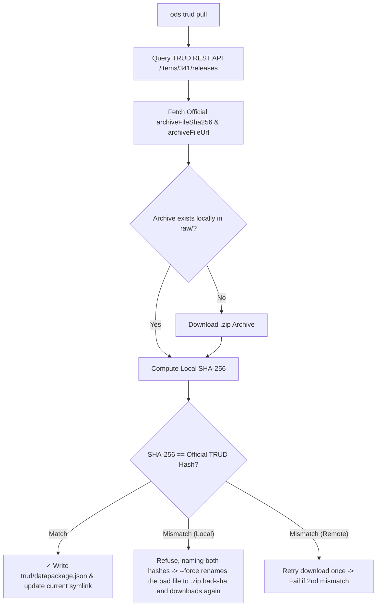

# `ods trud`

Publisher namespace for TRUD API interactions: list releases (`list`), download (`pull`), compare releases (`diff`), verify checksums (`verify`), and audit workspace projections (`audit`).

## Subcommands overview

| Subcommand | Description |
| :--- | :--- |
| **`ods trud list`** | List TRUD release archives, newest first, and show which are held in the workspace. |
| **`ods trud pull`** | Download official release archives from TRUD REST API, verify SHA-256 checksums, write the pull record `trud/datapackage.json` for `ods make` to build from, and set the active workspace release. |
| **`ods trud diff`** | Compare two TRUD ODS releases (or workspace versions) and print a structured diff report of entity changes. |
| **`ods trud audit`** | Audit workspace Parquet projections against ground-truth TRUD XML/ZIP releases to detect data drift or compilation anomalies. |
| **`ods trud verify`** | Check a TRUD archive you already have against the ods release index, then the TRUD API, without downloading it. |

## `ods trud list`

List available TRUD release versions, newest first, and show which are held in the workspace.

```bash
ods trud list
```

```text
┌────────────────────────────────────┐
│ Release        Size   State        │
╞════════════════════════════════════╡
│ 2026-07-31     36MB   pulled       │
│ 2026-06-26     36MB                │
│ 2026-05-29     36MB                │
│ 2026-04-24     36MB                │
│ 2026-03-27     36MB                │
│ 2026-02-27     35MB                │
│ 2026-01-30     35MB                │
│ 2025-12-19     35MB                │
│ 2025-11-28     35MB                │
│ 2025-10-31     35MB                │
│ ...85 more                         │
│ 2018-06-29     20MB                │
├────────────────────────────────────┤
│ 96 releases      --all to see more │
└────────────────────────────────────┘
* To pull: ods trud pull 2026-06-26
```

Pass `--all` to list every release without truncating.

## `ods trud pull`

Query, download, and verify official NHS England TRUD ODS XML release archives, generate provenance metadata, and manage workspace active release symlinks.

Pulling every release is `--all`, hidden from the idle curious because it downloads the whole archive from TRUD. Use it if you need it.

### Usage

```bash
ods trud pull [RELEASE_DATE] [OPTIONS]
```

### Options

| Option | Short | Environment variable | Default | Description |
| :--- | :--- | :--- | :--- | :--- |
| `[RELEASE_DATE]` | | | Latest available | Positional target release date, `YYYY-MM-DD` (e.g. `2026-07-31`). |
| `--api-key <KEY>` | | `TRUD_API_KEY` | | Your TRUD API key. Required unless set in environment or passed via 1Password (`op run`). |
| `--output <DIR>` | `-o` | | `./ods_data/releases/<date>/` | Custom destination directory for archive and provenance files. |
| `--force` | `-f` | | `false` | Re-fetch NHS's checksum, signature and key, and download the archive again only if it's missing or doesn't match TRUD's hash. |
| `--verify-only <FILE>` | | | | Compute local SHA-256 for `<FILE>` and verify against TRUD API without downloading. |
| `--jobs <N>` | | | `4` | Concurrent download workers (max 8). |
| `--local-archive <PATH>` | | | | Local archive or directory holding a canned TRUD `response.json` and ZIP, for offline testing. |
| `--workspace <DIR>` | `-w` | | found from the current directory | Workspace directory. |
| `--quiet` | `-q` | | `false` | Show errors and summary only. |
| `--no-progress` | | | `false` | Disable interactive live progress animations. |
| `--format <FORMAT>` | | | | Output format (`ndjson` for pull outcomes). |
| `--verbose` | `-v` | | `false` | Print API request URL and raw HTTP response payload before deserialisation. |

### Examples

Pull the latest release:
```console
$ ods trud pull
  2026-07-31    ████████████████████  36MB   5 files  in 3.1s
  verified      sha256 from TRUD API
  linked        current → releases/2026-07-31
```

If the archive is already held and matches:
```console
$ ods trud pull
  2026-07-31    ████████████████████  36MB   5 files  cached
  verified      sha256 from TRUD API
  linked        current → releases/2026-07-31 (unchanged)
```

With the key read from 1Password:
```bash
op run --env-file=.env -- ods trud pull
```

A specific release date, with verbose logging:
```bash
ods trud pull 2026-07-31 --api-key $TRUD_API_KEY --verbose
```

Saved to a custom directory:
```bash
ods trud pull --api-key $TRUD_API_KEY -o ./custom_downloads/
```

### How it works

NHS Digital / NHS England publishes monthly Organisation Data Service (ODS) updates on TRUD under Item Pack ID `341` (*NHS Organisation Data Service XML Data*).

`ods trud pull` executes the following sequence:
1. Queries TRUD REST API (`GET /trud/api/v1/keys/{api_key}/items/341/releases`).
2. Identifies the target release (defaults to the latest available release date).
3. Checks for a cached local archive in `./ods_data/releases/<date>/trud/`.
4. Downloads the archive ZIP if it isn't there. A ZIP that is there is never downloaded again while it matches TRUD's hash: the release directory is repaired from it instead (below).
5. Computes the local SHA-256 hash and checks it against TRUD's published `archiveFileSha256`.
6. Fetches NHS's checksum, signature and key, then writes `trud/datapackage.json`, the pull record, beside the archive it describes: the TRUD release as a Data Package, the archive's hash and size from TRUD's listing and the other three files' hashed from disk. It's never part of the dataset. `ods make` reads it and embeds the same facts in every Parquet file it writes (see [provenance.md](./provenance.md)).
7. Updates the workspace active release symlink (`./ods_data/current -> releases/<date>`).



### Repairing a release directory

The ZIP is the expensive part, and the one thing TRUD vouches for. When a release directory already holds it and its SHA-256 matches TRUD's listing, `ods trud pull <date>` keeps the ZIP and makes the rest whole from it: it fetches whichever of NHS's checksum, signature and public key are missing, writes `trud/datapackage.json` if it is missing or no longer matches the files beside it (replacing the `trud/_provenance.json` an older `ods` wrote), and removes a TRUD listing an older pull saved in `trud/`. The release block names what it did (`repaired: checksum, signature, key, provenance`). `--all` does the same for every release the workspace holds.

`--force` fetches NHS's three files again and rewrites `trud/datapackage.json`, and still leaves a matching ZIP alone. A ZIP that doesn't match TRUD's hash is refused without `--force`, with both hashes named; with it, the ZIP is downloaded again.

### API key security and redaction
TRUD download URLs embed user API keys directly in their path parameters (`/keys/{api_key}/...`). `ods trud pull` automatically redacts secret API keys from:
- `--verbose` CLI log messages
- Error tracebacks and log files

The key is replaced with `<REDACTED_API_KEY>` before logging or printing.

## `ods trud diff`

Compare entity changes across two TRUD releases:

```bash
ods trud diff 2026-06-30 2026-07-31
```

## `ods trud audit`

Verify that derived workspace artefacts are a faithful, complete, and unmodified projection of the source TRUD archive:

> **The audit contract**: Every check must have an expected value derivable from the release's own source archive, or be a fixed structural invariant such as zero.

- **File and provenance integrity**: Verifies SHA-256 checksums against the pull record (`trud/datapackage.json`) and the provenance the Parquet files carry, that every file reads as Parquet, and, when the release index names the release, that the manifest the files rebuild has the digest it records.
- **Source invariants**: Asserts global ID uniqueness (`uniqueRoleId`, `uniqueRelId`), 0 dangling references, `<CodeSystem>` integrity, date bounds, and verifies that redundant `<Rel><Target><PrimaryRoleId uniqueRoleId="..."/></Target></Rel>` match joined primary roles.
- **Record parity**: Checks 100% count equality between the release's XML files and `orgs.parquet` (every organisation, and the active count), `roles.parquet`, `relationships.parquet`, and `successions.parquet`. It reads both XML files as `ods make` does, sets aside each stub that repeats a complete record from the other file, and names the record count it compared.
- **Field and derived column parity**: Verifies verbatim source fields and recomputes derived columns (transitive closures, resolved hierarchies, role names and codes, normalised addresses).
- **Workspace batch audit (`--all`)**: Audits all release directories in the workspace, skipping unmade releases without failure.

```bash
ods trud audit                  # Audit active release in workspace
ods trud audit --all            # Audit all releases in workspace
ods trud audit --full           # Run 100% row-by-row field comparison
ods trud audit --json           # Output machine-readable audit report for CI
```

## `ods trud verify`

Check a TRUD archive you already have against a published SHA-256, without
downloading it. `ods` looks the release up in the [ods release index](./release-index.md) first, which
needs no API key, then asks the TRUD API when `TRUD_API_KEY` is set.

```bash
ods trud verify ./hscorgrefdataxml_data_7.0.0_20260731000001.zip
```

```text
✓ 2026-07-31  36MB  SHA-256 verified by ods release index
```

It exits 1 when the SHA-256 differs, or when neither source has one for that release.

