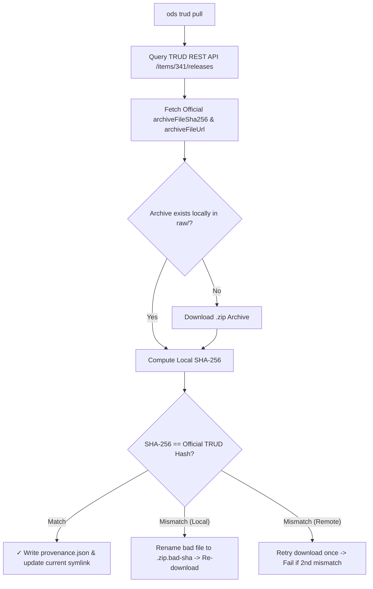

# `ods trud`

Publisher namespace for TRUD API interactions: query, download (`pull`), compare releases (`diff`), verify checksums (`verify`), and audit workspace projections (`audit`).

## Subcommands Overview

| Subcommand | Description |
| :--- | :--- |
| **`ods trud pull`** | Download official release archives from TRUD REST API, verify SHA-256 checksums, generate `provenance.json`, and set the active workspace release. |
| **`ods trud diff`** | Compare two TRUD ODS releases (or workspace versions) and print a structured diff report of entity changes. |
| **`ods trud audit`** | Audit workspace Parquet projections against ground-truth TRUD XML/ZIP releases to detect data drift or compilation anomalies. |
| **`ods trud verify`** | Check a TRUD archive you already have against the ods release index, then the TRUD API, without downloading it. |

---

## `ods trud pull`

Query, download, and verify official NHS England TRUD ODS XML release archives, generate cryptographic provenance metadata, and manage workspace active release symlinks.

### Usage

```bash
ods trud pull [OPTIONS]
```

### Options

| Option | Short | Environment Variable | Default | Description |
| :--- | :--- | :--- | :--- | :--- |
| `--api-key <KEY>` | | `TRUD_API_KEY` | | Your TRUD API key. Required unless set in environment or passed via 1Password (`op run`). |
| `--release <DATE>` | | | Latest available | Target release date in `YYYY-MM-DD` format (e.g. `2026-07-31`). |
| `--output <DIR>` | `-o` | | `./ods_data/releases/<date>/` | Custom destination directory for archive and provenance files. |
| `--verify-only <FILE>` | | | | Compute local SHA-256 for `<FILE>` and verify against TRUD API without downloading. |
| `--verbose` | `-v` | | `false` | Print API request URL and raw HTTP response payload before deserialization. |

### Examples

#### Pull Latest Release (via 1Password)
```bash
op run --env-file=.env -- ods trud pull
```

#### Target Specific Release Date with Verbose Logging
```bash
ods trud pull --api-key $TRUD_API_KEY --release 2026-07-31 --verbose
```

#### Save to Custom Directory
```bash
ods trud pull --api-key $TRUD_API_KEY -o ./custom_downloads/
```

### How It Works

NHS Digital / NHS England publishes monthly Organisation Data Service (ODS) updates on TRUD under Item Pack ID `341` (*NHS Organisation Data Service XML Data*).

`ods trud pull` executes the following sequence:
1. Queries TRUD REST API (`GET /trud/api/v1/keys/{api_key}/items/341/releases`).
2. Identifies the target release (defaults to the latest available release date).
3. Checks for cached local archives in `./ods_data/releases/<date>/raw/`.
4. Downloads the archive ZIP if not cached.
5. Computes local SHA-256 hash and verifies cryptographic match against TRUD's published `archiveFileSha256`.
6. Generates or updates `provenance.json`.
7. Updates the workspace active release symlink (`./ods_data/current -> releases/<date>`).



### API Key Security & Redaction
TRUD download URLs embed user API keys directly in their path parameters (`/keys/{api_key}/...`). `ods trud pull` automatically redacts secret API keys from:
- `--verbose` CLI log messages
- Error tracebacks and log files

The key is replaced with `<REDACTED_API_KEY>` before logging or printing.

---

## `ods trud diff`

Compare entity changes across two TRUD releases.

```bash
ods trud diff --baseline 2026-06-30 --target 2026-07-31
```

---

## `ods trud audit`

Verify that derived workspace artefacts are a faithful, complete, and unmodified projection of the source TRUD archive:

> **The Audit Contract**: Every check must have an expected value derivable from the release's own source archive, or be a fixed structural invariant such as zero.

- **File & Provenance Integrity**: Verifies SHA-256 checksums, `_provenance.json` artifact map, and `datapackage.json` hashes.
- **Source Invariants**: Asserts global ID uniqueness (`uniqueRoleId`, `uniqueRelId`), 0 dangling references, `<CodeSystem>` integrity, date bounds, and verifies that redundant `<Rel><Target><PrimaryRoleId uniqueRoleId="..."/></Target></Rel>` match joined primary roles.
- **Record Parity**: Checks 100% count equality across `orgs_all.parquet`, `orgs.parquet` (active count), `org_roles.parquet`, `relationships.parquet`, and `successions.parquet`.
- **Field & Derived Column Parity**: Verifies verbatim source fields and recomputes derived columns (transitive closures, resolved hierarchies, role names & codes, normalized addresses).
- **Workspace Batch Audit (`--all`)**: Audits all release directories in the workspace, skipping unmade releases without failure.

```bash
ods trud audit                  # Audit active release in workspace
ods trud audit --all            # Audit all releases in workspace
ods trud audit --full           # Run 100% row-by-row field comparison
ods trud audit --json           # Output machine-readable audit report for CI
```

---

## `ods trud verify`

Check a TRUD archive you already have against a published SHA-256, without
downloading it. `ods` looks the release up in the ods release index first, which
needs no API key, then asks the TRUD API when `TRUD_API_KEY` is set.

```bash
ods trud verify ./hscorgrefdataxml_data_7.0.0_20260731000001.zip
```

```text
✓ 2026-07-31  36MB  SHA-256 verified by ods release index
```

It exits 1 when the SHA-256 differs, or when neither source has one for that release.

